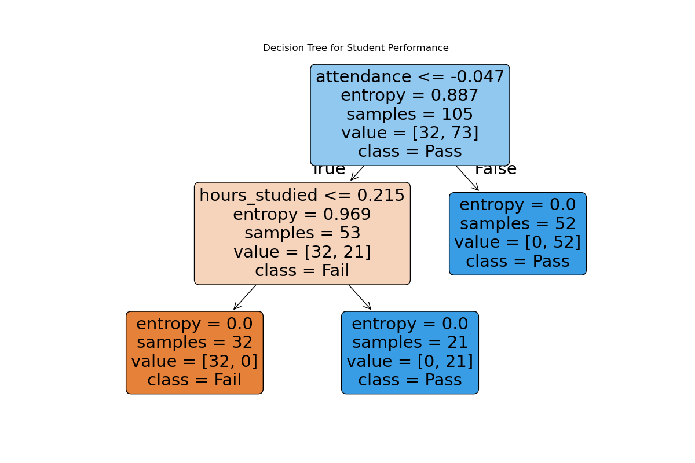

# 📘 **Student Exam Performance Prediction**

This project predicts whether a student will **pass or fail** based on **hours studied**, **sleep hours**, and **attendance**.  
It uses a **Decision Tree Classifier** for training and provides both **exploratory data analysis (EDA)** and an interactive **Streamlit web app** for predictions.  

---

## 🚀 **Features**

- **Exploratory Data Analysis (EDA)** with **Seaborn & Matplotlib**.  
- **Decision Tree Classifier** for **prediction**.  
- **Evaluation Metrics** including **Accuracy, Precision, Recall, and F1 Score**.  
- **Interactive Streamlit App** for **direct prediction**.  

---

## 📂 **Project Structure**

├── app.py # Streamlit app for prediction.
├── appimage.png #screenshot image
├── code.ipynb # Jupyter notebook for training & EDA.
├── destree_model.sav # Saved Decision Tree model.
├── req.txt # Requirements file.
├── student_exam_tree.csv # Dataset.
├── decision_tree.png # Decision Tree visualization image.
├── README.md # Documentation.

---

## 📈 **Evaluation Metrics**

The model is evaluated using:

- Accuracy  
- Precision  
- Recall  
- F1 Score  

These metrics help in understanding the overall performance of the classifier.  

---

## 🌳 **Decision Tree Visualization**

Below is the visualization of the trained **Decision Tree** model:  

---

## 🖼️ **App Screenshot**

Here is the interface of the **Streamlit App**:  

---

## 📌 **Future Improvements**

- Add more student-related features (assignments completed, stress level, etc.).  
- Compare with other ML models such as SVM, Random Forest, and Logistic Regression.  
- Deploy the app on Streamlit Cloud for easy access.  
- Enhance visual analytics with plots like ROC curve and Feature Importance.  
- Build a REST API for integrating predictions with other applications.  

---

## 👨‍💻 **Author**

AUTHOR : KAVINKUMAR T  
GITHUB : https://github.com/kavinkumart  

---

